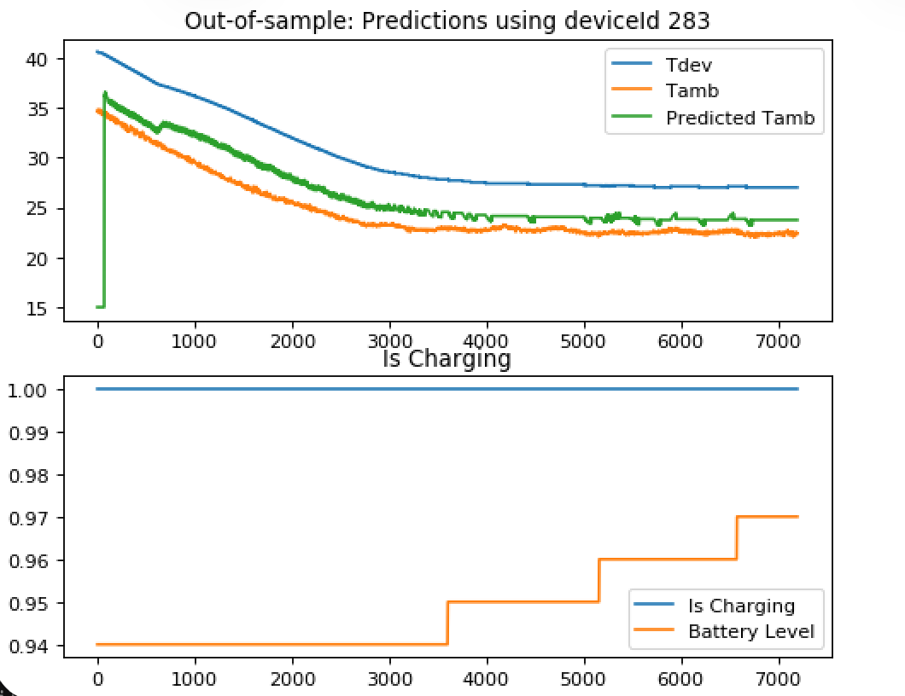

# Ambient Temperature Estimation

A physics-based temperature estimation engine written in C++ with a CPython/NumPy extension for calibration and analysis in Python.



*Out-of-sample run: the model recovers ambient temperature (green) from device temperature alone (blue), validated against the measured ambient trace (orange).*

## Overview

The model and optimizer are written in portable C++17 so the same fitted parameters and inference code can be deployed to resource-constrained edge devices. This repository contains the model, optimizer, lab-side Python bindings, and example notebooks — the embedded toolchain and on-device integration live outside this repo.

The split is deliberate: calibrate in Python against logged or synthetic data, then ship the same C++ inference code to the target.

## Model

Single-state thermal ODE for a device coupled to ambient:

```
dT_dev/dt = h · (T_amb − T_dev) + q
```

- `h` — heat transfer coefficient (fit)
- `q` — constant input term, e.g. self-heating (fit)
- `T_dev_0`, `T_amb_0` — initial conditions

`src/apis/python/examples/model_derivation.ipynb` derives the closed-form solution symbolically with SymPy.

## Modes

Two `Optimizer` subclasses, selected via the `model` setting:

- **`train`** — fits `h`, `q`, `T_dev_0` from a `[T_dev, T_amb]` time series
- **`predict`** — given fixed `h`, `q` from a prior fit, estimates `T_dev_0` and `T_amb_0` from a `T_dev` time series alone (the use case where ambient is not directly measured on-device)

## Technology stack

- C++17 numerical core
- Boost.Odeint (Runge–Kutta Dormand–Prince 5) for adaptive ODE integration
- NLopt Nelder–Mead for derivative-free parameter fitting (`xtol_rel = 1e-8`)
- CPython extension (`Python.h` + NumPy C-API) for the lab-side bindings
- CMake for native targets; `setup.py` for the Python extension

## Repository structure

- `src/headers/` — public interfaces and shared types
- `src/optimizer/` — fitting, ODE solver, objective function, data buffer
- `src/models/` — `BaseModelTrain` and `BaseModelPredict` subclasses
- `src/apis/optimizer_api.cpp` — public C++ API layer
- `src/apis/python/` — CPython extension, `setup.py`, example notebooks
- `src/test/` — `SmokeTestTrain`, `SmokeTestPredict` native binaries
- `data/long_chamber_data.csv` — sample logged `Tdev,Tamb` trace

## Build

### Native C++ targets

```bash
cmake .
make SmokeTestTrain SmokeTestPredict
./SmokeTestTrain
./SmokeTestPredict
```

The CMake config currently hard-codes `/usr/local/lib/libnlopt.dylib`, so non-macOS builds need to adjust [CMakeLists.txt](CMakeLists.txt).

### Python extension

```bash
cd src/apis/python
python setup.py build_ext --inplace
```

Requires Python 3.8 or 3.9 (the build uses `distutils`, which was removed in Python 3.12), NumPy, NLopt, and Boost.

## Python API

After building, the extension exposes `ambient_optimizer_python_api`:

```python
import ambient_optimizer_python_api as aopa

aopa.init({
    "model": "train",          # or "predict"
    "verbose": True,
    "initial_guesses": [],     # required for predict: [T_amb_0 guess]
    "fixed_parameters": [],    # required for predict: [h, q]
})

for t, (T_dev, T_amb) in enumerate(samples):
    aopa.feed(t, [T_dev, T_amb])   # predict mode feeds [T_dev] only

result = aopa.fit()
# -> {"is_valid", "rmse", "icount", "ifault", "fitted_params": {h, q, T_dev_0, T_amb_0}}

generated = aopa.generate(h, q, T_dev_0)
# -> {"length", "t": np.ndarray, "x": np.ndarray}
```

See `src/apis/python/test.py` for an end-to-end synthetic round-trip, and `src/apis/python/examples/` for Jupyter walkthroughs (`calibration.ipynb`, `prediction.ipynb`, `model_derivation.ipynb`).

## Credits

Written by [Ben Jordan](https://github.com/bjordan555) and [Andrew Aarestad](https://andrewaarestad.com).
